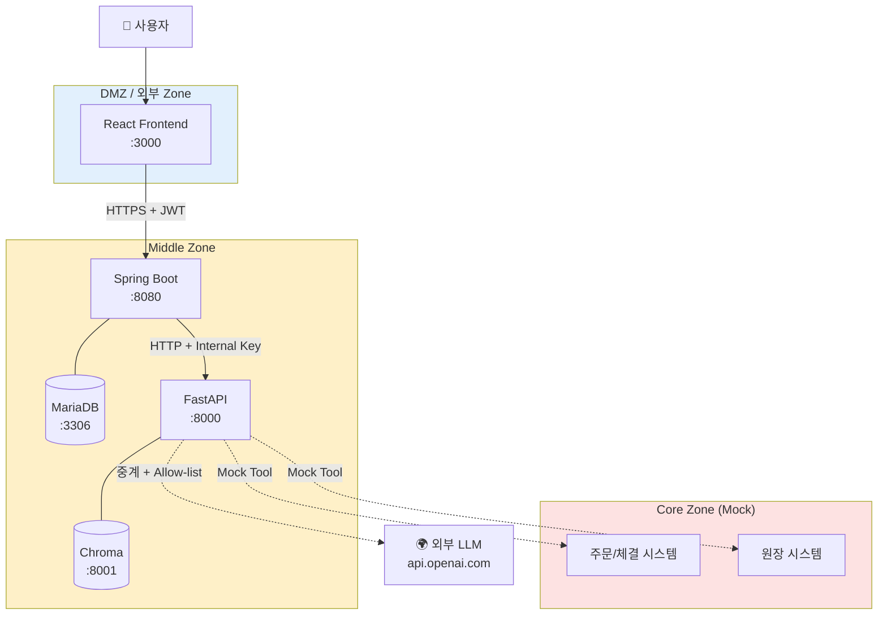

# Quant-X 3-Zone 매핑

## 본 과정 컴포넌트의 Zone 배치

```mermaid
graph TB
    USER[👤 사용자]

    subgraph DMZ["DMZ / 외부 Zone"]
        REACT[React Frontend<br/>:3000]
    end

    subgraph MIDDLE["Middle Zone"]
        BE[Spring Boot<br/>:8080]
        DB[(MariaDB<br/>:3306)]
        AI[FastAPI<br/>:8000]
        CHROMA[(Chroma<br/>:8001)]
        BE --- DB
        AI --- CHROMA
    end

    subgraph CORE["Core Zone (Mock)"]
        ORDER[주문/체결 시스템]
        ACCT[원장 시스템]
    end

    EXT[🌍 외부 LLM<br/>api.openai.com]

    USER --> REACT
    REACT -->|HTTPS + JWT| BE
    BE -->|HTTP + Internal Key| AI
    AI -.중계 + Allow-list.-> EXT
    AI -.Mock Tool.-> ORDER
    AI -.Mock Tool.-> ACCT

    style CORE fill:#fde2e2
    style MIDDLE fill:#fef0c8
    style DMZ fill:#e2f0fd
```
